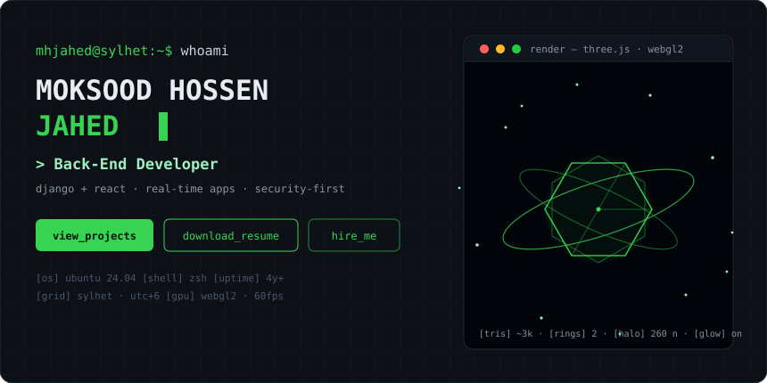
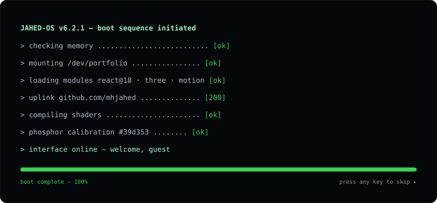
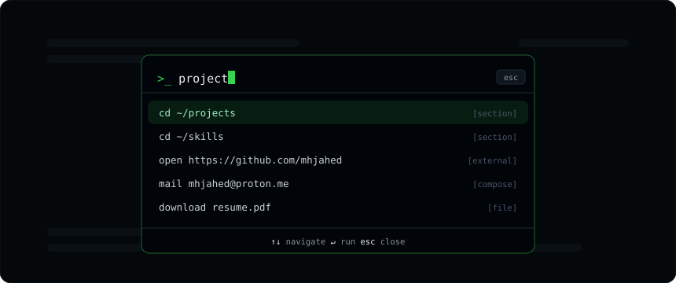

<!-- JAHED-OS · terminal portfolio · phosphor #39d353 on carbon #0d1117 · widgets verified 2026-09-12 · images: docs/assets/*.svg (ship with repo) -->

<div align="center">


<p>
  
  
  
  
  
  
</p>

<p>
  
  
  
  
  
</p>

</div>


## ▍$ man jahed-os

Not a website with a terminal theme — a **terminal that happens to be a website**.
It bootlogs itself awake, types its own CV, renders a WebGL core in a windowed
`render` process, answers to `ctrl+k`, and writes zero emojis anywhere in its
source. Every panel is a window. Every section is a command. Every interaction
has a man page below.

```yaml
binary      : jahed-os v1.0.0
author      : moksood hossen jahed — sylhet, bangladesh (utc+6)
shell       : react 18.3 · vite 5.4 · bootstrap 5.3 (grid only)
gpu driver  : three@0.175 · @react-three/fiber@8 · drei@9  (pinned on purpose)
motion      : framer-motion@12 · custom canvas engine
uplink      : emailjs (contact) · github rest api (live git feed)
deploy      : static build → cloudflare pages · any static host
```


## ▍$ ls /usr/share/features/

<table>
<tr>
<th width="50%">`theatre/` — the spectacle</th>
<th width="50%">`input/` — the interface</th>
</tr>
<tr>
<td valign="top">

▸ **boot sequence** — types `JAHED-OS` log + progress, skips on any key
▸ **particle engine** — hand-rolled canvas node-graph, mouse repulsion, capped DPR
▸ **webgl hero** — floating icosahedron core · twin orbit rings · 260-node halo
▸ **crt layer** — scanlines + vignette over everything, zero paint cost
▸ **scroll progress** — spring-smoothed phosphor bar
▸ **0-emoji policy** — structure via `▸ ▍ ├ └ ● ◐ ○` glyphs only

</td>
<td valign="top">

▸ **command palette** — `ctrl/⌘+k` · fuzzy search · arrows + enter + esc
▸ **easter inputs** — any-key boot skip · ticker hover-pause · cursor-play
▸ **prefers-reduced-motion** — ticker, cursors, scan-tricks power down
▸ **scroll-padding aware anchors** — no content ever hides under the navbar
▸ **smtp-style form replies** — `250 queued` / `550 relay error`

</td>
</tr>
<tr>
<th>`content/` — the substance</th>
<th>`engineering/` — the discipline</th>
</tr>
<tr>
<td valign="top">

▸ live **`git log`** strip → `api.github.com`, graceful offline fallback
▸ 12 project cards · status lights · `--all/--django/--react/--pinned` filters
▸ tabbed skill benchmarks · animated counters · journalctl timeline
▸ cert tree · geo panel · emailjs contact with simulation mode

</td>
<td valign="top">

▸ **webgl code-split** — `React.lazy`, 134 kB gz main thread first
▸ **r3f@8 + drei@9 pinning** — roadmap's "drei@10 + fiber@8" combo doesn't resolve
▸ aos/swiper/lottie/parallax **deleted** in favor of framer-motion (−bloat)
▸ one stylesheet, one font family, one accent color — the whole design system

</td>
</tr>
</table>


## ▍$ ./render --preview

<div align="center">



<br/>




<sub>svg mock-ups shipped in `docs/assets/` — cursors blink, rings orbit, progress bar loops.</sub>

</div>


## ▍$ cat arch.map

```
                 ┌──────────────────────────────┐
                 │   boot.jsx — types os log    │  (any key → skip)
                 └───────────────┬──────────────┘
                                 ▼
                ┌───────────────── App.jsx ─────────────────┐
                │  scroll-progress · scanlines · ⌘K keybind │
                └───────┬───────────────────────┬───────────┘
                        ▼                       ▼
                ┌───────────────┐      ┌──────────────────┐
                │    Navbar     │      │ CommandPalette   │
                │  blur · pill  │      │ fuzzy launcher   │
                └───────────────┘      └──────────────────┘
   ┌────────┬──────────┬─────────┼──────────┬─────────┬───────────┐
   ▼        ▼          ▼         ▼          ▼         ▼           ▼
 Hero    Ticker     About     Skills    Projects   Experience  Contact
 ├canvas ├marquee  ├json motd ├tabs     ├filters   ├timeline   ├emailjs
 └r3f↓            └counters  └bars     └git feed  └[active]   └geo panel
 (React.lazy — three.js streams after first paint, 221 kB gz off-thread)
```


## ▍$ cat stack.json

<div align="center">
  
</div>

<br/>

| PIECE | EXACTLY | ROLE |
|---|---|---|
| react + react-dom | `18.3.1` | the shell |
| vite + plugin-react | `^5.4 · ^4.3` | dev/build — node 18+ |
| bootstrap | `^5.3` | grid + dark primitives only; the rest is custom css |
| framer-motion | `^12` | reveals, layout filters, palette, springs, counters |
| three | `^0.175` | webgl core |
| @react-three/fiber | `^8.17` | react renderer for three |
| @react-three/drei | `^9.122` | `<Float/>` — v9 pairs fiber@v8 |
| @emailjs/browser | `^4.4` | contact form → inbox, no server |
| react-icons | `^5` | feather glyphs inside ui chrome |

<sub>version reality check: `drei@10` targets fiber@v9/react19 — pairing it with fiber@8 (as many roadmaps suggest) fails at install. this repo pins the battle-tested trio.</sub>


## ▍$ ./setup

```bash
git clone https://github.com/mhjahed/portfolio.git && cd portfolio
npm install                    # node 18+ (20/22/24 all verified)
npm run dev                    # → http://localhost:5173
npm run build                  # → dist/   (vite: 134 kB gz main + lazy webgl chunk)
```

<sub>`vite.config.js` carries two preview-proxy lines (`allowedHosts`, `hmr.clientPort`) — harmless everywhere; delete them for pure local development.</sub>

**deploy — cloudflare pages:** connect repo → preset **Vite** → build `npm run build` → output `dist` → env `NODE_VERSION=22` → deploy. zero config files needed.

## ▍$ cat config.md — make it yours (5 min)

| FILE | EDIT |
|---|---|
| `src/data/content.js` | **every word on the site** — bio, skills %, projects, experience, certs |
| `src/components/Contact.jsx` | paste emailjs `serviceId` / `templateId` / `publicKey` (quick literal or env-based flow) |
| `public/resume.pdf` | drop your real cv over the placeholder |
| `PROFILE.linkedin` in `content.js` | real linkedin url |


## ▍$ grep -R "key" bindings.map

| INPUT | EFFECT |
|---|---|
| `ctrl / ⌘ + k` | open command palette — sections, mail, resume, github |
| `↑ ↵ esc` (in palette) | navigate · run · close |
| any key / click (during boot) | skip the sequence |
| cursor × hero particles | nodes repel — go on, chase them |
| ticker hover | marquee pauses for reading |


## ▍$ tree src

```
src/
├── main.jsx                    bootstrap css+js · theme mount
├── App.jsx                     boot gate · palette keybind · scroll spring
├── styles/terminal.css         the entire design system — one sheet
├── data/content.js             single source of truth — every word
├── hooks/useTypewriter.js      type/delete/loop engine
└── components/
    ├── Boot.jsx                os boot log overlay, skippable
    ├── Navbar.jsx              blur bar · status pill · ⌘K button
    ├── Hero.jsx                whoami · typed roles · actions
    ├── Particles.jsx           canvas node-graph · mouse physics
    ├── HeroScene.jsx           r3f scene: core · rings · halo  (lazy)
    ├── Ticker.jsx              stack marquee strip
    ├── TerminalWindow.jsx      window chrome — the shared component
    ├── SectionHeader.jsx       $ cd ~/section headers
    ├── About.jsx               about.json viewer · motd · counters
    ├── Skills.jsx              tabbed animated benchmark bars
    ├── Projects.jsx            filters · cards · live git feed
    ├── Experience.jsx          journalctl career timeline
    ├── Education.jsx           degrees · cert --verify tree
    ├── Contact.jsx             emailjs form · smtp-style notices
    ├── CommandPalette.jsx      the ⌘K launcher
    └── Footer.jsx              footer · back-to-top (pid 1337 · exit 0)
```


## ▍$ find / -iname "\*roadmap\*" 2>/dev/null

- ▸ guestbook — signed by visitors, stored at the edge
- ▸ blog bridge — pull posts from the workers.dev api
- ▸ theme switch — phosphor green ⇄ amber ⇄ cyan presets
- ▸ sounds — optional retro terminal audio cues


<div align="center">

**`$ fortune`**

*"before developing a technology, assume it's ending."*

**built end-to-end by [MH JAHED](https://github.com/mhjahed)** · sylhet, bangladesh

<a href="mailto:mhjahed@proton.me"></a>
<a href="https://github.com/mhjahed"></a>
<a href="https://personal-blog.jah267478.workers.dev/"></a>

</div>


